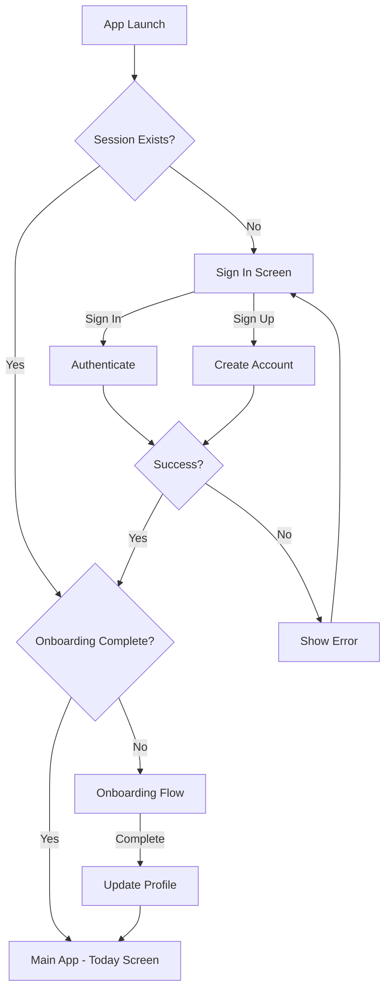
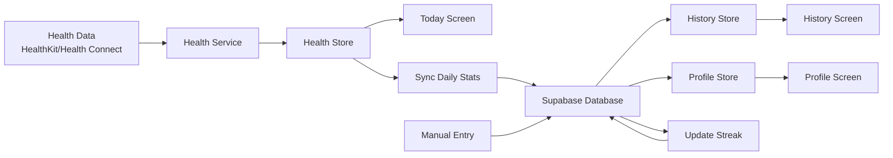

# Stepin MVP - Comprehensive Technical Documentation

**Version:** 1.0.0
**Last Updated:** October 6, 2025
**Status:** Phase 5 Complete (72.2% Overall - 100% Code, 0% Manual Testing)

---

## Table of Contents

1. [Project Overview](#1-project-overview)
2. [Architecture & Infrastructure](#2-architecture--infrastructure)
3. [Feature Implementation Details](#3-feature-implementation-details)
4. [Data Models & Types](#4-data-models--types)
5. [Component Hierarchy](#5-component-hierarchy)
6. [Integration Points & Services](#6-integration-points--services)
7. [Current Gaps & Known Issues](#7-current-gaps--known-issues)
8. [Map Feature Integration Analysis](#8-map-feature-integration-analysis)

---

## 1. Project Overview

### 1.1 App Identity

**Name:** Stepin
**Tagline:** "The only walking app that celebrates 2,000 steps as much as 10,000 steps"

**Purpose:**
A non-competitive wellness walking app designed for users of all fitness levels, with a focus on encouragement over competition. The app tracks daily steps, celebrates progress, and maintains streaks without comparing users to others.

**Core Value Proposition:**
- ✅ **No Competition** - Never shows other users' data or leaderboards
- ✅ **Automatic Tracking** - Integrates with iOS HealthKit and Android Health Connect
- ✅ **Simple & Encouraging** - Grandmother-friendly UI with positive reinforcement
- ✅ **Privacy First** - User data stays under user control

### 1.2 Target Platforms

- **iOS:** 14.0+ (HealthKit integration)
- **Android:** API 26+ / Android 8.0+ (Health Connect integration)
- **Distribution:** App Store and Google Play Store

### 1.3 Tech Stack Summary

| Category | Technology | Version |
|----------|-----------|---------|
| **Framework** | React Native | 0.81.4 (New Architecture) |
| **SDK** | Expo | ~54.0.12 (SDK 52+) |
| **Language** | TypeScript | ~5.9.2 |
| **Backend** | Supabase | 2.58.0 |
| **State Management** | Zustand | 5.0.8 |
| **Navigation** | Expo Router | ~6.0.10 |
| **Animations** | React Native Reanimated | ~4.1.1 |
| **Health (iOS)** | @kingstinct/react-native-healthkit | 11.0.0 |
| **Health (Android)** | react-native-health-connect | 3.4.0 |
| **Error Reporting** | @sentry/react-native | 6.22.0 |
| **Date Utilities** | date-fns | 4.1.0 |

### 1.4 Development Phase & Completion Status

**Current Phase:** Phase 5 Complete (Polish & Testing)

**Overall Completion:** 72.2%
- ✅ Code Implementation: 100%
- ⏳ Manual Testing: 0%

**Completed Phases:**
1. ✅ Phase 1: Foundation & Authentication (100%)
2. ✅ Phase 2: Core Step Tracking (100%)
3. ✅ Phase 3: History & Progress Tracking (100%)
4. ✅ Phase 4: Profile & Settings (100%)
5. ✅ Phase 5: Polish & Testing (100% implementation, testing pending)

**Remaining Work:**
- Phase 6: MVP Launch Prep (not started)
- Manual testing of all features
- App Store submission preparation

---

## 2. Architecture & Infrastructure

### 2.1 Project Structure

```
stepin-app/
├── app/                          # Expo Router file-based navigation
│   ├── (auth)/                   # Authentication screens (layout group)
│   │   ├── sign-in.tsx          # Sign in screen
│   │   ├── sign-up.tsx          # Sign up screen
│   │   └── onboarding.tsx       # 6-step onboarding flow
│   ├── (tabs)/                   # Main app tabs (layout group)
│   │   ├── _layout.tsx          # Tab bar configuration
│   │   ├── index.tsx            # Today screen (home)
│   │   ├── history.tsx          # History screen
│   │   └── profile.tsx          # Profile screen
│   ├── modals/                   # Modal screens
│   │   └── log-walk.tsx         # Manual walk logging modal
│   └── _layout.tsx              # Root layout with auth routing
├── components/                   # Reusable UI components
│   ├── onboarding/              # Onboarding-specific components
│   │   ├── OnboardingStep.tsx
│   │   └── ProgressDots.tsx
│   ├── AnimatedButton.tsx       # Animated button with haptics
│   ├── CalendarHeatMap.tsx      # Calendar visualization
│   ├── ConfettiCelebration.tsx  # Confetti animation
│   ├── EmptyState.tsx           # Empty state component
│   ├── ErrorBoundary.tsx        # React error boundary
│   ├── GoalCelebrationModal.tsx # Goal achievement modal
│   ├── LogWalkModal.tsx         # Walk logging form
│   ├── OfflineBanner.tsx        # Offline detection banner
│   ├── PermissionBanner.tsx     # Health permissions banner
│   ├── SkeletonLoader.tsx       # Loading skeletons
│   ├── StepCircle.tsx           # Circular progress indicator
│   ├── StreakDisplay.tsx        # Streak counter
│   ├── StreakMilestoneModal.tsx # Streak celebration
│   ├── WalkListItem.tsx         # Walk list item
│   └── ... (30+ components)
├── lib/                          # Business logic and utilities
│   ├── animations/              # Animation utilities
│   │   └── celebrationAnimations.ts
│   ├── health/                  # Health data services
│   │   ├── index.ts            # Platform-agnostic interface
│   │   ├── HealthKitService.ts # iOS HealthKit
│   │   └── HealthConnectService.ts # Android Health Connect
│   ├── notifications/           # Notification service
│   │   └── notificationService.ts
│   ├── store/                   # Zustand state stores
│   │   ├── authStore.ts        # Authentication state
│   │   ├── healthStore.ts      # Health data state
│   │   ├── historyStore.ts     # History data state
│   │   └── profileStore.ts     # Profile state
│   ├── supabase/               # Supabase client
│   │   └── client.ts
│   ├── theme/                  # Theme management
│   │   └── themeManager.tsx
│   └── utils/                  # Utility functions
│       ├── deleteWalk.ts
│       ├── errorMessages.ts
│       ├── fetchHistoryData.ts
│       ├── logger.ts           # Centralized logging
│       ├── profileUtils.ts
│       ├── syncDailyStats.ts
│       └── updateStreak.ts
├── types/                       # TypeScript type definitions
│   ├── auth.ts
│   ├── database.ts
│   ├── history.ts
│   └── profile.ts
├── constants/                   # App constants
│   ├── Colors.ts               # Color palette
│   ├── Layout.ts               # Layout constants
│   └── Typography.ts           # Typography system
└── assets/                      # Static assets
    ├── icon.png
    ├── splash-icon.png
    └── adaptive-icon.png
```

### 2.2 Key Dependencies

**Core Framework:**
- `expo` (~54.0.12) - Expo SDK for managed workflow
- `react` (19.1.0) - React library
- `react-native` (0.81.4) - React Native with New Architecture
- `expo-router` (~6.0.10) - File-based navigation

**Backend & Data:**
- `@supabase/supabase-js` (^2.58.0) - Supabase client
- `zustand` (^5.0.8) - State management
- `@react-native-async-storage/async-storage` (^2.2.0) - Local storage
- `expo-secure-store` (~15.0.7) - Secure token storage

**Health Integration:**
- `@kingstinct/react-native-healthkit` (^11.0.0) - iOS HealthKit
- `react-native-health-connect` (^3.4.0) - Android Health Connect

**UI & Animations:**
- `react-native-reanimated` (~4.1.1) - Animations
- `react-native-gesture-handler` (^2.28.0) - Gestures
- `react-native-svg` (^15.8.0) - SVG support
- `react-native-circular-progress` (^1.4.1) - Progress rings
- `react-native-confetti-cannon` (^1.5.2) - Confetti effects
- `@expo/vector-icons` (^15.0.2) - Icon library

**Utilities:**
- `date-fns` (^4.1.0) - Date manipulation
- `expo-haptics` (^15.0.7) - Haptic feedback
- `expo-notifications` (^0.32.12) - Local notifications
- `@sentry/react-native` (^6.22.0) - Error reporting

### 2.3 Database Schema (Supabase)

**Supabase Project:**
- Project ID: `mvvndpuwrbsrahytxtjf`
- Region: `us-east-1`
- Database: PostgreSQL 15

#### Tables Overview

| Table | Purpose | Row Count (Typical) |
|-------|---------|---------------------|
| `profiles` | User profile data | 1 per user |
| `walks` | Individual walk records | 100-1000 per user |
| `daily_stats` | Aggregated daily statistics | 365 per user/year |
| `streaks` | Streak tracking | 1 per user |

#### Table: `profiles`

Extends Supabase `auth.users` with app-specific user data.

```sql
create table public.profiles (
  id uuid references auth.users on delete cascade primary key,
  email text unique not null,
  display_name text,
  avatar_url text,
  daily_step_goal integer default 7000,
  units_preference text default 'miles'
    check (units_preference in ('miles', 'kilometers')),
  theme_preference text default 'system'
    check (theme_preference in ('light', 'dark', 'system')),
  notification_settings jsonb default
    '{"dailyReminder": false, "streakReminder": false,
      "goalCelebration": false, "reminderTime": "09:00"}'::jsonb,
  onboarding_completed boolean default false,
  created_at timestamp with time zone default timezone('utc'::text, now()) not null,
  updated_at timestamp with time zone default timezone('utc'::text, now()) not null
);
```

**Indexes:**
- Primary key on `id`
- Unique index on `email`

**RLS Policies:**
- Users can view own profile
- Users can update own profile

#### Table: `walks`

Stores individual walk records logged by users.

```sql
create table public.walks (
  id uuid default uuid_generate_v4() primary key,
  user_id uuid references public.profiles(id) on delete cascade not null,
  date date not null,
  steps integer not null check (steps >= 0 and steps <= 200000),
  duration_minutes integer check (duration_minutes >= 0),
  distance_meters numeric(10,2) check (distance_meters >= 0),
  created_at timestamp with time zone default timezone('utc'::text, now()) not null,
  updated_at timestamp with time zone default timezone('utc'::text, now()) not null
);
```

**Indexes:**
- Primary key on `id`
- Index on `(user_id, date)` for efficient queries
- Index on `user_id` for user-specific queries

**RLS Policies:**
- Users can view own walks
- Users can insert own walks
- Users can update own walks
- Users can delete own walks

#### Table: `daily_stats`

Aggregated daily statistics for performance optimization.

```sql
create table public.daily_stats (
  id uuid default uuid_generate_v4() primary key,
  user_id uuid references public.profiles(id) on delete cascade not null,
  date date not null,
  total_steps integer default 0,
  goal_met boolean default false,
  created_at timestamp with time zone default timezone('utc'::text, now()) not null,
  updated_at timestamp with time zone default timezone('utc'::text, now()) not null,
  unique(user_id, date)
);
```

**Indexes:**
- Primary key on `id`
- Unique index on `(user_id, date)`
- Index on `user_id` for user-specific queries

**RLS Policies:**
- Users can view own stats
- Users can insert own stats
- Users can update own stats

#### Table: `streaks`

Tracks current and longest streaks for users.

```sql
create table public.streaks (
  id uuid default uuid_generate_v4() primary key,
  user_id uuid references public.profiles(id) on delete cascade not null unique,
  current_streak integer default 0,
  longest_streak integer default 0,
  last_activity_date date,
  created_at timestamp with time zone default timezone('utc'::text, now()) not null,
  updated_at timestamp with time zone default timezone('utc'::text, now()) not null
);
```

**Indexes:**
- Primary key on `id`
- Unique index on `user_id`

**RLS Policies:**
- Users can view own streak
- Users can insert own streak
- Users can update own streak

#### Storage Buckets

**Bucket: `avatars`**
- Purpose: User profile pictures
- Public: No (authenticated users only)
- File size limit: 2MB
- Allowed MIME types: `image/jpeg`, `image/png`, `image/webp`
- RLS: Users can upload/update/delete own avatar

### 2.4 Authentication Flow



**Authentication Provider:** Supabase Auth

**Session Management:**
- Tokens stored in `expo-secure-store` (encrypted)
- Auto-refresh enabled
- Session persistence across app restarts

**Sign Up Flow:**
1. User enters email, password, display name
2. Supabase creates auth user
3. Database trigger creates profile record
4. User redirected to onboarding
5. After onboarding, `onboarding_completed` flag set to true

**Sign In Flow:**
1. User enters email and password
2. Supabase validates credentials
3. Session token stored securely
4. Check onboarding status
5. Redirect to appropriate screen

**Protected Routes:**
- All routes in `(tabs)` group require authentication
- Expo Router handles automatic redirects
- Auth state managed by `authStore`

### 2.5 State Management Architecture (Zustand)

Stepin uses Zustand for global state management with four main stores:

#### `authStore` (`lib/store/authStore.ts`)

**Purpose:** Manages authentication state and actions

**State:**
```typescript
{
  user: User | null;
  session: Session | null;
  loading: boolean;
  error: string | null;
}
```

**Actions:**
- `signIn(email, password)` - Sign in user
- `signUp(email, password, displayName)` - Create new account
- `signOut()` - Sign out and clear session
- `checkSession()` - Verify existing session
- `clearError()` - Clear error state

#### `healthStore` (`lib/store/healthStore.ts`)

**Purpose:** Manages health data and permissions

**State:**
```typescript
{
  todaySteps: number;
  permissionsGranted: boolean;
  permissionsChecked: boolean;
  loading: boolean;
  syncing: boolean;
  lastSynced: Date | null;
  error: string | null;
}
```

**Actions:**
- `requestPermissions()` - Request health permissions
- `checkPermissions()` - Check permission status
- `syncTodaySteps(userId, stepGoal)` - Sync today's steps
- `syncHistoricalData(startDate, endDate)` - Sync date range
- `getStepsForDate(date)` - Get steps for specific date
- `setTodaySteps(steps)` - Manually set step count
- `clearError()` - Clear error state
- `reset()` - Reset store to initial state

#### `profileStore` (`lib/store/profileStore.ts`)

**Purpose:** Manages user profile and settings

**State:**
```typescript
{
  profile: UserProfile | null;
  stats: UserStats | null;
  loading: boolean;
  notificationIds: NotificationIdentifiers;
  error: string | null;
}
```

**Actions:**
- `loadProfile(userId)` - Load user profile
- `loadStats(userId)` - Load user statistics
- `updateGoal(goal)` - Update daily step goal
- `updateUnits(units)` - Update units preference
- `updateTheme(theme)` - Update theme preference
- `updateNotificationSettings(settings)` - Update notification preferences
- `setNotificationId(type, id)` - Store notification identifier
- `clearProfile()` - Clear profile data
- `clearError()` - Clear error state

#### `historyStore` (`lib/store/historyStore.ts`)

**Purpose:** Manages walk history and statistics

**State:**
```typescript
{
  walks: Walk[];
  dailyStats: DailyStats[];
  loading: boolean;
  error: string | null;
}
```

**Actions:**
- `loadWalks(userId, startDate, endDate)` - Load walks for date range
- `loadDailyStats(userId, startDate, endDate)` - Load daily stats
- `addWalk(walk)` - Add new walk
- `updateWalk(walkId, updates)` - Update existing walk
- `deleteWalk(walkId)` - Delete walk
- `clearHistory()` - Clear history data
- `clearError()` - Clear error state

### 2.6 API Integrations

#### Supabase Integration

**Client Configuration:** `lib/supabase/client.ts`

```typescript
import { createClient } from '@supabase/supabase-js';
import * as SecureStore from 'expo-secure-store';

const supabase = createClient(supabaseUrl, supabaseAnonKey, {
  auth: {
    storage: ExpoSecureStoreAdapter, // Custom secure storage
    autoRefreshToken: true,
    persistSession: true,
    detectSessionInUrl: false,
  },
});
```

**Key Features:**
- Secure token storage using `expo-secure-store`
- Automatic token refresh
- Session persistence across app restarts
- Row Level Security (RLS) enforcement

**Common Operations:**
```typescript
// Query walks
const { data, error } = await supabase
  .from('walks')
  .select('*')
  .eq('user_id', userId)
  .gte('date', startDate)
  .lte('date', endDate)
  .order('date', { ascending: false });

// Insert walk
const { data, error } = await supabase
  .from('walks')
  .insert({
    user_id: userId,
    date: '2025-10-06',
    steps: 8500,
    duration_minutes: 45,
    distance_meters: 6800,
  });

// Update profile
const { data, error } = await supabase
  .from('profiles')
  .update({ daily_step_goal: 10000 })
  .eq('id', userId);
```

#### HealthKit Integration (iOS)

**Service:** `lib/health/HealthKitService.ts`

**Package:** `@kingstinct/react-native-healthkit`

**Permissions Requested:**
- Step count (read)
- Walking/running distance (read)
- Active energy burned (read)

**Key Methods:**
```typescript
class HealthKitService {
  async isAvailable(): Promise<boolean>
  async requestPermissions(): Promise<PermissionResult>
  async getTodaySteps(): Promise<number>
  async getStepsForDate(date: Date): Promise<number>
  async getStepsForDateRange(start: Date, end: Date): Promise<StepData[]>
}
```

**Data Sync Strategy:**
- Query HealthKit on app launch
- Query on pull-to-refresh
- Background sync not implemented (requires additional permissions)
- Data aggregated by day

#### Health Connect Integration (Android)

**Service:** `lib/health/HealthConnectService.ts`

**Package:** `react-native-health-connect`

**Permissions Requested:**
- Steps (read)
- Distance (read)
- Active calories burned (read)

**Key Methods:**
```typescript
class HealthConnectService {
  async isAvailable(): Promise<boolean>
  async requestPermissions(): Promise<PermissionResult>
  async getTodaySteps(): Promise<number>
  async getStepsForDate(date: Date): Promise<number>
  async getStepsForDateRange(start: Date, end: Date): Promise<StepData[]>
}
```

**Platform Abstraction:**

Both services implement the same interface defined in `lib/health/index.ts`:

```typescript
export interface HealthService {
  isAvailable(): Promise<boolean>;
  requestPermissions(): Promise<PermissionResult>;
  getTodaySteps(): Promise<number>;
  getStepsForDate(date: Date): Promise<number>;
  getStepsForDateRange(start: Date, end: Date): Promise<StepData[]>;
}

export function getHealthService(): HealthService {
  return Platform.OS === 'ios'
    ? new HealthKitService()
    : new HealthConnectService();
}
```

---

## 3. Feature Implementation Details

### 3.1 Today Screen (Home)

**File:** `app/(tabs)/index.tsx`

**Purpose:** Primary screen showing today's step progress and encouraging users.

**Key Components:**
- `StepCircle` - Circular progress indicator (0-100% of goal)
- `StreakDisplay` - Current streak counter with flame icon
- `StatsCard` - Duration, distance, calories display
- `GoalCelebrationModal` - Appears when goal is met (once per day)
- `StreakMilestoneModal` - Appears on streak milestones (7, 14, 21, 30, 60, 90, 100+ days)
- `PermissionBanner` - Prompts for health permissions if not granted

**Features:**
- Real-time step count from health data
- Progress ring animation
- Encouraging messages based on progress
- Pull-to-refresh to sync latest data
- Goal celebration with confetti
- Streak milestone celebrations
- Offline support with banner

**Data Flow:**
1. Component mounts → Check health permissions
2. If granted → Sync today's steps from HealthKit/Health Connect
3. Update `healthStore.todaySteps`
4. Calculate progress percentage
5. Check if goal met → Show celebration modal (once per day)
6. Check streak milestones → Show milestone modal

**Calculations:**
```typescript
// Progress percentage
const progress = Math.min((todaySteps / dailyStepGoal) * 100, 100);

// Duration estimate (average 100 steps/minute)
const durationMinutes = Math.round(todaySteps / 100);

// Distance calculation
const distanceMeters = todaySteps * 0.762; // Average stride length
const distanceMiles = distanceMeters / 1609.34;
const distanceKm = distanceMeters / 1000;

// Calories estimate (0.04 calories per step)
const calories = Math.round(todaySteps * 0.04);
```

**Encouraging Messages:**
- 0-25%: "Every step counts! 🌱"
- 25-50%: "You're making progress! 💪"
- 50-75%: "Halfway there! Keep going! 🚶"
- 75-99%: "Almost there! You've got this! 🎯"
- 100%+: "Goal crushed! Amazing! 🎉"

### 3.2 History Screen

**File:** `app/(tabs)/history.tsx`

**Purpose:** Display walk history with charts, calendar, and detailed statistics.

**Key Components:**
- `TimePeriodSelector` - Week/Month/Year selector
- `StepsBarChart` - Bar chart showing steps over time
- `CalendarHeatMap` - GitHub-style calendar visualization
- `WalksList` - List of individual walks
- `WalkListItem` - Individual walk card with swipe-to-delete
- `WalkDetailsSheet` - Bottom sheet with walk details
- `SummaryStatsGrid` - Total steps, walks, average stats
- `InsightsSection` - Personalized insights and trends
- `EmptyHistoryState` - Empty state when no walks logged

**Features:**
- Time period filtering (week, month, year)
- Bar chart visualization
- Calendar heat map (color intensity based on steps)
- Walk list with animations
- Swipe-to-delete with confirmation
- Walk details modal
- Summary statistics
- Insights and trends
- Empty states
- Skeleton loading states

**Data Flow:**
1. Component mounts → Load walks and daily stats for selected period
2. User changes time period → Reload data
3. Data stored in `historyStore`
4. Charts and lists render from store data
5. User swipes to delete → Confirmation dialog → Delete from Supabase → Update store

**Chart Data Processing:**
```typescript
// Bar chart data (last 7/30/365 days)
const chartData = dailyStats.map(stat => ({
  date: stat.date,
  steps: stat.total_steps,
  goalMet: stat.goal_met,
}));

// Calendar heat map data
const heatMapData = dailyStats.reduce((acc, stat) => {
  acc[stat.date] = {
    steps: stat.total_steps,
    intensity: Math.min(stat.total_steps / dailyStepGoal, 1),
  };
  return acc;
}, {});
```

**Summary Statistics:**
```typescript
const totalSteps = walks.reduce((sum, walk) => sum + walk.steps, 0);
const totalWalks = walks.length;
const averageSteps = totalWalks > 0 ? Math.round(totalSteps / totalWalks) : 0;
const daysWithGoalMet = dailyStats.filter(s => s.goal_met).length;
const goalMetPercentage = (daysWithGoalMet / dailyStats.length) * 100;
```

### 3.3 Profile Screen

**File:** `app/(tabs)/profile.tsx`

**Purpose:** User profile management, settings, and preferences.

**Key Components:**
- `ProfileHeader` - Avatar, name, email display
- `StatsGrid` - Total steps, walks, member since, current streak
- `GoalSlider` - Interactive slider to adjust daily step goal
- `SettingsSection` - Grouped settings
- `SettingRow` - Individual setting item
- `TimePickerModal` - Time picker for notification settings

**Features:**
- Profile display and editing
- Avatar upload (Supabase Storage)
- Daily step goal adjustment (2,000-20,000 steps)
- Units preference (miles/kilometers)
- Theme preference (light/dark/system)
- Notification settings (daily reminder, streak reminder, goal celebration)
- Reminder time picker
- Data export (JSON format)
- Account deletion
- Sign out

**Settings Categories:**

1. **Goals**
   - Daily step goal slider
   - Real-time preview

2. **Preferences**
   - Units (miles/kilometers)
   - Theme (light/dark/system)

3. **Notifications**
   - Daily reminder toggle
   - Streak reminder toggle
   - Goal celebration toggle
   - Reminder time picker

4. **Data & Privacy**
   - Export data (JSON)
   - Delete account (with confirmation)

5. **Account**
   - Sign out

**Data Export Format:**
```json
{
  "profile": {
    "email": "user@example.com",
    "display_name": "John Doe",
    "daily_step_goal": 7000,
    "created_at": "2025-01-01T00:00:00Z"
  },
  "walks": [
    {
      "date": "2025-10-06",
      "steps": 8500,
      "duration_minutes": 45,
      "distance_meters": 6800
    }
  ],
  "daily_stats": [
    {
      "date": "2025-10-06",
      "total_steps": 8500,
      "goal_met": true
    }
  ],
  "streak": {
    "current_streak": 15,
    "longest_streak": 30
  }
}
```

### 3.4 Walk Logging (Manual Entry)

**File:** `components/LogWalkModal.tsx`

**Purpose:** Allow users to manually log walks when health data is unavailable.

**Features:**
- Date picker (no future dates)
- Step count input (0-200,000 validation)
- Duration input (optional, 0-1,440 minutes)
- Distance input (optional, calculated from steps if not provided)
- Input validation with error messages
- Duplicate walk warning
- Unusually high step count confirmation
- Haptic feedback on submission

**Validation Rules:**
```typescript
// Steps validation
if (steps < 0 || steps > 200000) {
  error = "Steps must be between 0 and 200,000";
}
if (steps > 50000) {
  showConfirmation = "That's a lot of steps! Are you sure?";
}

// Duration validation
if (duration < 0 || duration > 1440) {
  error = "Duration must be between 0 and 1,440 minutes (24 hours)";
}

// Date validation
if (date > today) {
  error = "Cannot log walks in the future";
}

// Duplicate check
const existingWalk = walks.find(w => w.date === selectedDate);
if (existingWalk) {
  showConfirmation = "You already have a walk on this date. Add another?";
}
```

**Data Flow:**
1. User opens modal
2. Selects date (defaults to today)
3. Enters step count
4. Optionally enters duration and distance
5. Validation runs on input
6. User submits
7. Walk inserted into Supabase `walks` table
8. Daily stats updated/created
9. Streak updated
10. Modal closes
11. History refreshes

### 3.5 Streak System

**Files:**
- `lib/utils/updateStreak.ts` - Streak calculation logic
- `components/StreakDisplay.tsx` - Streak UI component
- `components/StreakMilestoneModal.tsx` - Milestone celebration

**Calculation Logic:**

```typescript
async function updateStreak(userId: string, date: string, goalMet: boolean) {
  // 1. Get current streak record
  const streak = await getStreak(userId);

  // 2. Get yesterday's date
  const yesterday = subDays(parseISO(date), 1);

  // 3. Check if yesterday had activity
  const yesterdayStats = await getDailyStats(userId, yesterday);

  // 4. Calculate new streak
  if (goalMet) {
    if (yesterdayStats?.goal_met) {
      // Continue streak
      streak.current_streak += 1;
    } else {
      // Start new streak
      streak.current_streak = 1;
    }

    // Update longest streak if needed
    if (streak.current_streak > streak.longest_streak) {
      streak.longest_streak = streak.current_streak;
    }
  } else {
    // Goal not met, check if streak should break
    if (date !== today) {
      // Historical data, don't break current streak
    } else {
      // Today's data, break streak
      streak.current_streak = 0;
    }
  }

  // 5. Update last activity date
  streak.last_activity_date = date;

  // 6. Save to database
  await updateStreakInDB(userId, streak);

  return streak;
}
```

**Milestone Celebrations:**
- 7 days: "One week strong! 🔥"
- 14 days: "Two weeks of consistency! 💪"
- 21 days: "Three weeks! You're building a habit! 🌟"
- 30 days: "One month streak! Incredible! 🎉"
- 60 days: "Two months! You're unstoppable! 🚀"
- 90 days: "Three months! This is a lifestyle! 🏆"
- 100+ days: "100+ days! You're a walking legend! 👑"

**Streak Display:**
- Flame icon (🔥)
- Current streak number
- Animated pulse on milestone
- Tap to view streak history (future feature)

### 3.6 Notifications

**File:** `lib/notifications/notificationService.ts`

**Package:** `expo-notifications`

**Notification Types:**

1. **Daily Reminder**
   - Scheduled at user-selected time (default: 9:00 AM)
   - Message: "Time to get moving! 🚶 Let's hit your step goal today."
   - Repeats daily

2. **Streak Reminder**
   - Scheduled at 8:00 PM if goal not met
   - Message: "Don't break your {X} day streak! 🔥 Just a few more steps!"
   - Only sent if user has active streak

3. **Goal Celebration**
   - Triggered when goal is met
   - Message: "🎉 You did it! {X} steps today! Goal crushed!"
   - Sent once per day

**Permission Flow:**
1. Request during onboarding (optional step)
2. Can be enabled later in Profile settings
3. iOS: Requires explicit permission
4. Android: Requires notification channel setup

**Scheduling:**
```typescript
// Daily reminder
await Notifications.scheduleNotificationAsync({
  content: {
    title: "Time to get moving! 🚶",
    body: "Let's hit your step goal today.",
    sound: true,
  },
  trigger: {
    hour: 9,
    minute: 0,
    repeats: true,
  },
});

// Streak reminder (conditional)
if (currentStreak > 0 && !goalMet && currentHour >= 20) {
  await Notifications.scheduleNotificationAsync({
    content: {
      title: `Don't break your ${currentStreak} day streak! 🔥`,
      body: "Just a few more steps!",
      sound: true,
    },
    trigger: {
      seconds: 60, // Send in 1 minute
    },
  });
}
```

### 3.7 Onboarding

**File:** `app/(auth)/onboarding.tsx`

**Purpose:** 6-step onboarding flow for new users.

**Steps:**

1. **Welcome** - App introduction and value props
   - App logo
   - Mission statement
   - 3 key benefits (no competition, automatic tracking, simple)
   - "Get Started" button

2. **How It Works** - 3-step explanation
   - Track automatically with health data
   - Set your personal goal
   - Celebrate your progress
   - "Next" button

3. **Goal Setting** - Interactive goal selection
   - Large goal number display
   - Slider (2,000-20,000 steps)
   - 3 preset suggestions:
     - Light: 5,000 steps
     - Moderate: 7,000 steps
     - Active: 10,000 steps
   - "Next" button

4. **Health Permissions** - Request health data access
   - Platform-specific messaging (HealthKit/Health Connect)
   - Privacy reassurance
   - "Grant Permission" button
   - "Skip for now" option

5. **Notifications** - Optional notification setup
   - Notification benefits explanation
   - "Enable Notifications" button
   - "Skip" option

6. **Ready** - Completion and summary
   - Success checkmark
   - "You're all set! 🎉"
   - Summary of daily goal
   - "Start Walking" button

**Navigation:**
- Horizontal FlatList with pagination
- Progress dots at top
- Back button (hidden on first step)
- Skip buttons on optional steps (4 & 5)
- Smooth animated transitions

**Completion:**
- Saves `daily_step_goal` to profile
- Sets `onboarding_completed` to true
- Navigates to main app (Today screen)

### 3.8 Theme System

**File:** `lib/theme/themeManager.tsx`

**Features:**
- Light mode
- Dark mode
- System preference (follows device)
- Persistent theme selection
- React Context for theme access

**Color Palette:**

```typescript
export interface ColorPalette {
  // Primary colors
  primary: {
    main: string;      // Brand color
    light: string;
    dark: string;
  };

  // Background colors
  background: {
    primary: string;   // Main background
    secondary: string; // Card background
    tertiary: string;  // Elevated surfaces
  };

  // Text colors
  text: {
    primary: string;   // Main text
    secondary: string; // Subtle text
    tertiary: string;  // Disabled text
    inverse: string;   // Text on dark backgrounds
  };

  // Border colors
  border: {
    light: string;
    medium: string;
    dark: string;
  };

  // Status colors
  status: {
    success: string;   // Green
    warning: string;   // Yellow
    error: string;     // Red
    info: string;      // Blue
  };

  // System colors
  system: {
    blue: string;
    green: string;
    orange: string;
    red: string;
    purple: string;
    pink: string;
  };
}
```

**Usage:**
```typescript
import { useTheme } from '@/lib/theme/themeManager';

function MyComponent() {
  const { colors, theme, setTheme } = useTheme();

  return (
    <View style={{ backgroundColor: colors.background.primary }}>
      <Text style={{ color: colors.text.primary }}>Hello</Text>
    </View>
  );
}
```

### 3.9 Error Handling

**Components:**
- `ErrorBoundary` - Catches React errors
- `OfflineBanner` - Shows offline status
- `EmptyState` - Handles empty data scenarios

**Error Messages Utility:** `lib/utils/errorMessages.ts`

**Error Types Handled:**
1. Network errors (offline, timeout)
2. Authentication errors (invalid credentials, session expired)
3. Permission errors (health data denied)
4. Validation errors (invalid input)
5. Database errors (query failed, constraint violation)
6. Health sync errors (HealthKit/Health Connect unavailable)

**User-Friendly Error Messages:**
```typescript
export const ERROR_MESSAGES = {
  NETWORK_ERROR: "Unable to connect. Please check your internet connection.",
  AUTH_INVALID_CREDENTIALS: "Invalid email or password. Please try again.",
  HEALTH_PERMISSION_DENIED: "Health data access denied. You can still log walks manually.",
  VALIDATION_STEPS_INVALID: "Steps must be between 0 and 200,000.",
  DATABASE_ERROR: "Something went wrong. Please try again.",
  // ... 13 total error types
};
```

**ErrorBoundary Integration:**
- Wraps entire app in `app/_layout.tsx`
- Catches uncaught React errors
- Displays friendly fallback UI
- "Try Again" button to reset
- Reports to Sentry in production

**Offline Support:**
- `OfflineBanner` appears at top when offline
- Shows last sync time
- Dismissible by user
- Auto-dismisses when back online
- Uses `@react-native-community/netinfo`

### 3.10 Animations

**File:** `lib/animations/celebrationAnimations.ts`

**Animation Types:**

1. **Button Animations**
   - Press: Scale down to 0.95
   - Release: Spring back to 1.0
   - Haptic feedback on press

2. **Celebration Animations**
   - Scale pulse (1.0 → 1.2 → 1.0)
   - Confetti cannon
   - Haptic success feedback

3. **List Item Animations**
   - Entrance: Slide in from right with stagger
   - Exit: Fade out
   - Swipe: Translate X for delete

4. **Modal Animations**
   - Entrance: Slide up + fade in
   - Exit: Slide down + fade out
   - Backdrop: Fade in/out

5. **Tab Bar Animations**
   - Active tab: Scale to 1.1
   - Inactive tab: Scale to 1.0
   - Haptic light impact on change

6. **Progress Ring Animation**
   - Smooth circular progress
   - Color transition based on percentage
   - Animated stroke

**Reduced Motion Support:**
- Checks `AccessibilityInfo.isReduceMotionEnabled()`
- Disables animations if enabled
- Instant transitions instead
- Maintains functionality

**Haptic Feedback:**
```typescript
import * as Haptics from 'expo-haptics';

// Light impact (button press)
Haptics.impactAsync(Haptics.ImpactFeedbackStyle.Light);

// Medium impact (toggle)
Haptics.impactAsync(Haptics.ImpactFeedbackStyle.Medium);

// Heavy impact (delete)
Haptics.impactAsync(Haptics.ImpactFeedbackStyle.Heavy);

// Success (goal met)
Haptics.notificationAsync(Haptics.NotificationFeedbackType.Success);

// Error (validation failed)
Haptics.notificationAsync(Haptics.NotificationFeedbackType.Error);
```

---

## 4. Data Models & Types

### 4.1 Database Types (`types/database.ts`)

```typescript
export interface Profile {
  id: string;
  email: string;
  display_name: string;
  avatar_url?: string;
  daily_step_goal: number;
  created_at: string;
  updated_at: string;
}

export interface Walk {
  id: string;
  user_id: string;
  date: string;
  steps: number;
  duration_minutes?: number;
  distance_meters?: number;
  created_at: string;
}

export interface DailyStats {
  id: string;
  user_id: string;
  date: string;
  total_steps: number;
  goal_met: boolean;
  created_at: string;
}

export interface Streak {
  id: string;
  user_id: string;
  current_streak: number;
  longest_streak: number;
  last_activity_date?: string;
  created_at: string;
  updated_at: string;
}
```

### 4.2 Profile Types (`types/profile.ts`)

```typescript
export type UnitsPreference = 'miles' | 'kilometers';
export type ThemePreference = 'light' | 'dark' | 'system';
export type NotificationType = 'dailyReminder' | 'streakReminder' | 'goalCelebration';

export interface NotificationSettings {
  dailyReminder: boolean;
  streakReminder: boolean;
  goalCelebration: boolean;
  reminderTime: string; // Format: "HH:mm"
}

export interface UserProfile {
  id: string;
  email: string;
  display_name: string | null;
  avatar_url: string | null;
  daily_step_goal: number;
  units_preference: UnitsPreference;
  theme_preference: ThemePreference;
  notification_settings: NotificationSettings;
  created_at: string;
  updated_at: string;
}

export interface UserStats {
  totalSteps: number;
  totalWalks: number;
  memberSince: string;
  currentStreak: number;
}
```

### 4.3 Health Data Types

```typescript
export interface StepData {
  date: string;
  steps: number;
  startDate?: Date;
  endDate?: Date;
}

export interface PermissionResult {
  granted: boolean;
  message?: string;
}

export interface HealthService {
  isAvailable(): Promise<boolean>;
  requestPermissions(): Promise<PermissionResult>;
  getTodaySteps(): Promise<number>;
  getStepsForDate(date: Date): Promise<number>;
  getStepsForDateRange(start: Date, end: Date): Promise<StepData[]>;
}
```

### 4.4 Data Flow Diagram



---

## 5. Component Hierarchy

### 5.1 Screen Components

**Authentication Screens:**
- `app/(auth)/sign-in.tsx` - Sign in form
- `app/(auth)/sign-up.tsx` - Sign up form
- `app/(auth)/onboarding.tsx` - 6-step onboarding

**Main App Screens:**
- `app/(tabs)/index.tsx` - Today screen (home)
- `app/(tabs)/history.tsx` - History screen
- `app/(tabs)/profile.tsx` - Profile screen

**Modal Screens:**
- `app/modals/log-walk.tsx` - Manual walk logging

### 5.2 Reusable UI Components

**Display Components:**
- `StepCircle` - Circular progress indicator
- `StreakDisplay` - Streak counter with flame icon
- `StatsCard` - Individual stat display
- `StatsGrid` - Grid of stats
- `SummaryStatsCard` - Summary statistics
- `ProfileHeader` - User profile header
- `WalkListItem` - Walk list item with swipe actions
- `CalendarDay` - Single day in calendar
- `CalendarHeatMap` - GitHub-style calendar
- `DayDetailsCard` - Day details display

**Input Components:**
- `AnimatedButton` - Animated button with haptics
- `GoalSlider` - Slider for goal adjustment
- `TimePickerModal` - Time picker modal
- `LogWalkModal` - Walk logging form

**Feedback Components:**
- `ConfettiCelebration` - Confetti animation
- `GoalCelebrationModal` - Goal achievement modal
- `StreakMilestoneModal` - Streak milestone modal
- `EmptyState` - Empty state display
- `EmptyHistoryState` - History-specific empty state
- `EmptyPeriodState` - Period-specific empty state
- `SkeletonLoader` - Loading skeletons
- `OfflineBanner` - Offline status banner
- `PermissionBanner` - Permission request banner
- `ErrorBoundary` - Error boundary wrapper

**Layout Components:**
- `SettingsSection` - Settings section container
- `SettingRow` - Individual setting row
- `TimePeriodSelector` - Time period selector
- `InsightsCard` - Insights card
- `InsightsSection` - Insights section

**Chart Components:**
- `StepsBarChart` - Bar chart for steps
- `WalkDetailsSheet` - Walk details bottom sheet

**Onboarding Components:**
- `OnboardingStep` - Onboarding step container
- `ProgressDots` - Progress indicator dots

### 5.3 Utility Functions & Services

**Health Services:**
- `lib/health/HealthKitService.ts` - iOS HealthKit integration
- `lib/health/HealthConnectService.ts` - Android Health Connect integration
- `lib/health/index.ts` - Platform-agnostic interface

**Notification Service:**
- `lib/notifications/notificationService.ts` - Notification scheduling and management

**Utility Functions:**
- `lib/utils/deleteWalk.ts` - Delete walk with cascade updates
- `lib/utils/errorMessages.ts` - User-friendly error messages
- `lib/utils/fetchHistoryData.ts` - Fetch and process history data
- `lib/utils/logger.ts` - Centralized logging with Sentry integration
- `lib/utils/profileUtils.ts` - Profile data export and account deletion
- `lib/utils/syncDailyStats.ts` - Sync daily statistics
- `lib/utils/updateStreak.ts` - Update streak calculations

**Animation Utilities:**
- `lib/animations/celebrationAnimations.ts` - Animation helpers and sequences

---

## 6. Integration Points & Services

### 6.1 Health Data Services

**Platform Detection:**
```typescript
import { Platform } from 'react-native';
import { HealthKitService } from './HealthKitService';
import { HealthConnectService } from './HealthConnectService';

export function getHealthService(): HealthService {
  return Platform.OS === 'ios'
    ? new HealthKitService()
    : new HealthConnectService();
}
```

**Common Interface:**
All health services implement the same interface for consistency:
- `isAvailable()` - Check if health data is available
- `requestPermissions()` - Request health data permissions
- `getTodaySteps()` - Get today's step count
- `getStepsForDate(date)` - Get steps for specific date
- `getStepsForDateRange(start, end)` - Get steps for date range

### 6.2 Supabase Client Configuration

**File:** `lib/supabase/client.ts`

**Key Features:**
- Secure token storage using `expo-secure-store`
- Automatic token refresh
- Session persistence
- Custom storage adapter for React Native

**Environment Variables:**
```bash
EXPO_PUBLIC_SUPABASE_URL=https://mvvndpuwrbsrahytxtjf.supabase.co
EXPO_PUBLIC_SUPABASE_ANON_KEY=<anon_key>
```

### 6.3 Notification Service

**File:** `lib/notifications/notificationService.ts`

**Key Functions:**
- `requestNotificationPermissions()` - Request permissions
- `scheduleNotification(type, time)` - Schedule notification
- `cancelNotification(id)` - Cancel scheduled notification
- `cancelAllNotifications()` - Cancel all notifications
- `updateNotificationSchedule(settings)` - Update schedule based on settings

### 6.4 Logger Utility & Sentry Integration

**File:** `lib/utils/logger.ts`

**Purpose:** Centralized logging that respects `__DEV__` flag

**Features:**
- Console logging in development
- Sentry error reporting in production
- Four log levels: error, warn, info, debug
- Automatic error context capture

**Sentry Configuration:**
- Organization: steppin
- Project: react-native
- DSN: Configured in `app/_layout.tsx`
- Integration with ErrorBoundary
- Integration with logger utility

**Usage:**
```typescript
import { logger } from '@/lib/utils/logger';

// Error logging (sends to Sentry in production)
logger.error('Failed to fetch walks', error);

// Warning logging
logger.warn('Deprecated API usage');

// Info logging
logger.info('User logged in');

// Debug logging
logger.debug('Detailed debug info');
```

### 6.5 File Storage (Avatars)

**Supabase Storage Bucket:** `avatars`

**Configuration:**
- Public: No (authenticated users only)
- File size limit: 2MB
- Allowed MIME types: image/jpeg, image/png, image/webp

**Upload Flow:**
```typescript
// 1. Pick image
const result = await ImagePicker.launchImageLibraryAsync({
  mediaTypes: ImagePicker.MediaTypeOptions.Images,
  allowsEditing: true,
  aspect: [1, 1],
  quality: 0.8,
});

// 2. Upload to Supabase Storage
const fileName = `${userId}-${Date.now()}.jpg`;
const { data, error } = await supabase.storage
  .from('avatars')
  .upload(fileName, file);

// 3. Get public URL
const { data: urlData } = supabase.storage
  .from('avatars')
  .getPublicUrl(fileName);

// 4. Update profile with avatar URL
await supabase
  .from('profiles')
  .update({ avatar_url: urlData.publicUrl })
  .eq('id', userId);
```

---

## 7. Current Gaps & Known Issues

### 7.1 Incomplete Features

**Manual Testing (0% Complete):**
- ❌ Authentication flows not manually tested
- ❌ Health integration not tested on physical devices
- ❌ Today screen not manually tested
- ❌ History screen not manually tested
- ❌ Profile screen not manually tested
- ❌ Animations not tested for performance
- ❌ Cross-platform compatibility not verified
- ❌ Edge cases not tested
- ❌ Accessibility not tested with VoiceOver/TalkBack

**Phase 6 (Not Started):**
- ❌ App Store assets (screenshots, descriptions)
- ❌ Privacy policy and terms of service
- ❌ App Store submission
- ❌ TestFlight/Google Play beta testing
- ❌ Production build configuration
- ❌ Analytics integration
- ❌ Crash reporting verification

### 7.2 Technical Debt

**Performance:**
- Large walk lists may need virtualization optimization
- Calendar heat map could be optimized for large datasets
- Image caching not implemented for avatars

**Data Sync:**
- No background sync for health data (requires additional permissions)
- No offline queue for writes (writes fail when offline)
- No conflict resolution for concurrent edits

**Testing:**
- No unit tests written
- No integration tests written
- No E2E tests written

**Documentation:**
- No inline JSDoc comments for most functions
- No component prop documentation
- No API documentation

### 7.3 Known Issues

**iOS:**
- HealthKit permissions must be requested on physical device (simulator not supported)
- Background health data sync not implemented

**Android:**
- Health Connect requires Android 8.0+ (API 26+)
- Health Connect app must be installed separately on some devices

**Cross-Platform:**
- Avatar upload not tested on Android
- Notification scheduling not tested on Android
- Theme system not tested with system dark mode changes

**UI/UX:**
- No loading states for avatar upload
- No progress indicator for data export
- No confirmation for account deletion beyond text input
- Calendar heat map may be hard to read on small screens

### 7.4 Areas Requiring Improvement

**Accessibility:**
- Need to test with VoiceOver (iOS) and TalkBack (Android)
- Need to verify color contrast ratios
- Need to test with large text sizes
- Need to verify touch target sizes (44x44pt minimum)

**Error Handling:**
- Need more specific error messages for health sync failures
- Need retry logic for failed network requests
- Need better offline experience (queue writes)

**Performance:**
- Need to profile animation performance
- Need to optimize large list rendering
- Need to implement image caching

**Security:**
- Need to implement rate limiting for API calls
- Need to add CAPTCHA for sign up (prevent spam)
- Need to implement session timeout

---

## 8. Map Feature Integration Analysis

### 8.1 Recommended Architecture Location

**New Screen:** `app/(tabs)/map.tsx`

**Tab Bar Position:** Between History and Profile tabs

**Rationale:**
- Logical flow: Today → History → Map → Profile
- Map shows spatial representation of walks (complements History's temporal view)
- Keeps main tracking (Today) as first tab
- Profile remains easily accessible as last tab

**Alternative:** Modal screen accessible from History screen
- Pros: Doesn't add another tab, contextual to walk history
- Cons: Less discoverable, requires extra tap to access

### 8.2 Required Database Changes

#### New Fields for `walks` Table

```sql
-- Add GPS coordinate fields to walks table
ALTER TABLE public.walks
ADD COLUMN route_coordinates jsonb,
ADD COLUMN start_location jsonb,
ADD COLUMN end_location jsonb,
ADD COLUMN elevation_gain numeric(10,2),
ADD COLUMN average_pace numeric(10,2);

-- Add indexes for geospatial queries (if needed later)
CREATE INDEX idx_walks_route_coordinates ON public.walks
USING gin (route_coordinates);

-- Add check constraint for coordinate format
ALTER TABLE public.walks
ADD CONSTRAINT check_route_coordinates_format
CHECK (
  route_coordinates IS NULL OR
  jsonb_typeof(route_coordinates) = 'array'
);
```

#### Data Structure for GPS Coordinates

```typescript
// Route coordinates (array of lat/lng points)
route_coordinates: [
  { lat: 37.7749, lng: -122.4194, timestamp: "2025-10-06T10:00:00Z" },
  { lat: 37.7750, lng: -122.4195, timestamp: "2025-10-06T10:00:30Z" },
  // ... more points
]

// Start location (single point)
start_location: {
  lat: 37.7749,
  lng: -122.4194,
  address: "123 Main St, San Francisco, CA" // optional
}

// End location (single point)
end_location: {
  lat: 37.7760,
  lng: -122.4200,
  address: "456 Market St, San Francisco, CA" // optional
}
```

### 8.3 TypeScript Type Updates

**Update `types/database.ts`:**

```typescript
export interface GeoCoordinate {
  lat: number;
  lng: number;
  timestamp?: string;
  altitude?: number;
  accuracy?: number;
}

export interface Location {
  lat: number;
  lng: number;
  address?: string;
}

export interface Walk {
  id: string;
  user_id: string;
  date: string;
  steps: number;
  duration_minutes?: number;
  distance_meters?: number;
  route_coordinates?: GeoCoordinate[]; // NEW
  start_location?: Location;           // NEW
  end_location?: Location;             // NEW
  elevation_gain?: number;             // NEW
  average_pace?: number;               // NEW (minutes per mile/km)
  created_at: string;
}
```

### 8.4 Suggested Implementation Approach

#### Phase 1: Basic Map Display (Week 1)

**Goal:** Display walks on a map with markers

**Components to Create:**
- `app/(tabs)/map.tsx` - Main map screen
- `components/MapView.tsx` - Map component wrapper
- `components/WalkMarker.tsx` - Custom marker for walk locations
- `components/MapFilterControls.tsx` - Date range filter

**Libraries to Add:**
```json
{
  "react-native-maps": "^1.14.0",
  "expo-location": "~18.0.7"
}
```

**Features:**
- Display map centered on user's location
- Show markers for each walk's start location
- Tap marker to see walk details
- Filter walks by date range
- Zoom to fit all markers

**Data Flow:**
1. Load walks from `historyStore`
2. Filter walks that have `start_location`
3. Render markers on map
4. Handle marker tap → Show walk details

#### Phase 2: Route Tracking (Week 2)

**Goal:** Track and display walking routes

**Components to Create:**
- `components/RouteRecorder.tsx` - GPS tracking during walk
- `components/RoutePolyline.tsx` - Display route on map
- `components/LiveTrackingControls.tsx` - Start/stop/pause tracking

**New Permissions Required:**
- iOS: `NSLocationWhenInUseUsageDescription`, `NSLocationAlwaysAndWhenInUseUsageDescription`
- Android: `ACCESS_FINE_LOCATION`, `ACCESS_COARSE_LOCATION`

**Features:**
- Start/stop route tracking
- Record GPS coordinates during walk
- Display live route on map
- Calculate distance from GPS data
- Save route to database on completion
- Display historical routes on map

**GPS Tracking Logic:**
```typescript
import * as Location from 'expo-location';

async function startRouteTracking() {
  // Request permissions
  const { status } = await Location.requestForegroundPermissionsAsync();
  if (status !== 'granted') return;

  // Start tracking
  const subscription = await Location.watchPositionAsync(
    {
      accuracy: Location.Accuracy.High,
      timeInterval: 5000,  // Update every 5 seconds
      distanceInterval: 10, // Or every 10 meters
    },
    (location) => {
      // Add coordinate to route
      addCoordinate({
        lat: location.coords.latitude,
        lng: location.coords.longitude,
        timestamp: new Date(location.timestamp).toISOString(),
        altitude: location.coords.altitude,
        accuracy: location.coords.accuracy,
      });
    }
  );

  return subscription;
}
```

#### Phase 3: Route Analysis (Week 3)

**Goal:** Provide insights about walking routes

**Components to Create:**
- `components/RouteStats.tsx` - Route statistics display
- `components/ElevationChart.tsx` - Elevation profile
- `components/PaceChart.tsx` - Pace over time

**Features:**
- Calculate elevation gain/loss
- Calculate average pace
- Identify fastest/slowest segments
- Compare routes
- Suggest similar routes

**Calculations:**
```typescript
// Distance between two coordinates (Haversine formula)
function calculateDistance(coord1: GeoCoordinate, coord2: GeoCoordinate): number {
  const R = 6371e3; // Earth radius in meters
  const φ1 = coord1.lat * Math.PI / 180;
  const φ2 = coord2.lat * Math.PI / 180;
  const Δφ = (coord2.lat - coord1.lat) * Math.PI / 180;
  const Δλ = (coord2.lng - coord1.lng) * Math.PI / 180;

  const a = Math.sin(Δφ/2) * Math.sin(Δφ/2) +
            Math.cos(φ1) * Math.cos(φ2) *
            Math.sin(Δλ/2) * Math.sin(Δλ/2);
  const c = 2 * Math.atan2(Math.sqrt(a), Math.sqrt(1-a));

  return R * c; // Distance in meters
}

// Total route distance
function calculateRouteDistance(coordinates: GeoCoordinate[]): number {
  let totalDistance = 0;
  for (let i = 1; i < coordinates.length; i++) {
    totalDistance += calculateDistance(coordinates[i-1], coordinates[i]);
  }
  return totalDistance;
}

// Average pace (minutes per mile/km)
function calculateAveragePace(
  distance: number,
  duration: number,
  units: 'miles' | 'kilometers'
): number {
  const distanceInUnits = units === 'miles'
    ? distance / 1609.34
    : distance / 1000;
  return duration / distanceInUnits; // minutes per unit
}

// Elevation gain
function calculateElevationGain(coordinates: GeoCoordinate[]): number {
  let gain = 0;
  for (let i = 1; i < coordinates.length; i++) {
    const elevationChange =
      (coordinates[i].altitude || 0) - (coordinates[i-1].altitude || 0);
    if (elevationChange > 0) {
      gain += elevationChange;
    }
  }
  return gain;
}
```

### 8.5 Integration with Existing Walk Logging

**Update `components/LogWalkModal.tsx`:**

```typescript
// Add option to attach route to manual entry
const [attachRoute, setAttachRoute] = useState(false);
const [selectedRoute, setSelectedRoute] = useState<GeoCoordinate[] | null>(null);

// Allow user to:
// 1. Record route live (if logging walk in real-time)
// 2. Select from recent routes (if logging historical walk)
// 3. Skip route (optional)
```

**Update `lib/health/HealthKitService.ts` and `HealthConnectService.ts`:**

```typescript
// Check if health data includes route information
// iOS: HKWorkoutRoute
// Android: Health Connect may have route data

async getRouteForWorkout(workoutId: string): Promise<GeoCoordinate[]> {
  // iOS: Query HKWorkoutRoute
  // Android: Query Health Connect route data
  // Return array of coordinates
}
```

### 8.6 Privacy Considerations

**Location Data Privacy:**
- Store GPS data only with explicit user consent
- Add privacy policy section about location data
- Allow users to delete route data separately from walk data
- Don't share location data with third parties
- Consider anonymizing/fuzzing start/end locations (e.g., round to nearest 100m)

**UI for Privacy:**
- Clear explanation of why location is needed
- Option to disable route tracking
- Option to delete all route data
- Visual indicator when tracking is active

### 8.7 Performance Considerations

**Large Route Data:**
- Limit coordinate frequency (e.g., one point every 10 meters or 5 seconds)
- Simplify routes using Douglas-Peucker algorithm before storing
- Lazy load route data (don't load all routes at once)
- Use map clustering for many markers

**Battery Impact:**
- Use appropriate GPS accuracy (High accuracy drains battery faster)
- Stop tracking when app is backgrounded (unless user explicitly enables background tracking)
- Provide battery usage warning

### 8.8 Recommended Map Libraries

**Primary Choice: `react-native-maps`**
- Pros: Most popular, well-maintained, supports iOS and Android
- Cons: Requires native configuration

**Alternative: `expo-maps` (if available in Expo SDK 52+)**
- Pros: Easier setup with Expo, no native configuration
- Cons: May have fewer features than react-native-maps

**For Route Simplification:**
- `simplify-js` - Douglas-Peucker algorithm for route simplification

### 8.9 Estimated Implementation Timeline

| Phase | Duration | Complexity |
|-------|----------|------------|
| Phase 1: Basic Map Display | 1 week | Low |
| Phase 2: Route Tracking | 2 weeks | Medium |
| Phase 3: Route Analysis | 1 week | Medium |
| **Total** | **4 weeks** | **Medium** |

### 8.10 Migration Strategy for Existing Data

**Existing walks don't have GPS data:**
- Display walks without routes as simple markers at user's general location
- Add "Add Route" button to historical walks
- Allow users to manually draw routes on map (optional feature)
- Clearly indicate which walks have route data vs. which don't

---

## Conclusion

This technical documentation provides a comprehensive overview of the Stepin MVP architecture, implementation details, and a detailed analysis for integrating a map feature. The app is currently at 72.2% completion (100% code, 0% manual testing) and ready for the map feature integration after manual testing is complete.

**Next Steps:**
1. Complete manual testing of existing features
2. Fix any bugs discovered during testing
3. Implement map feature (Phases 1-3)
4. Test map feature thoroughly
5. Proceed to Phase 6 (MVP Launch Prep)

**For Map Feature Implementation:**
- Start with Phase 1 (Basic Map Display) to validate approach
- Gather user feedback before investing in route tracking
- Consider privacy implications carefully
- Test battery impact thoroughly
- Ensure performance with large datasets

---

**Document Version:** 1.0.0
**Last Updated:** October 6, 2025
**Maintained By:** Development Team